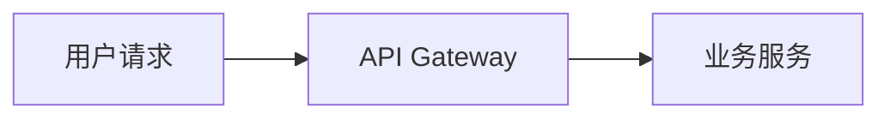
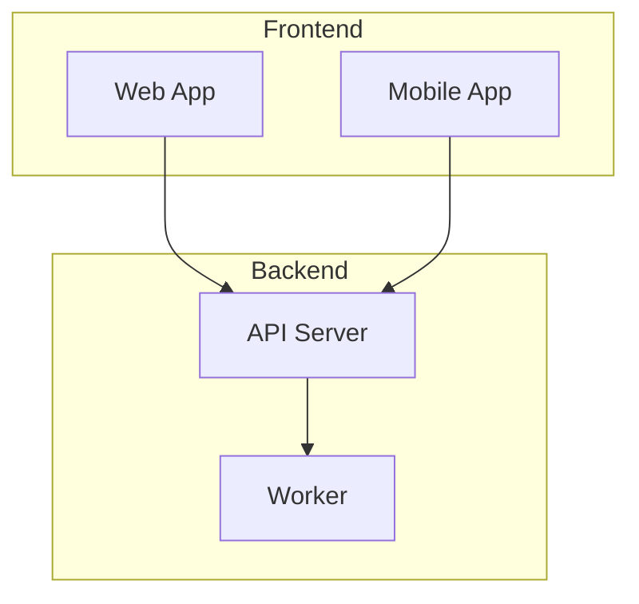
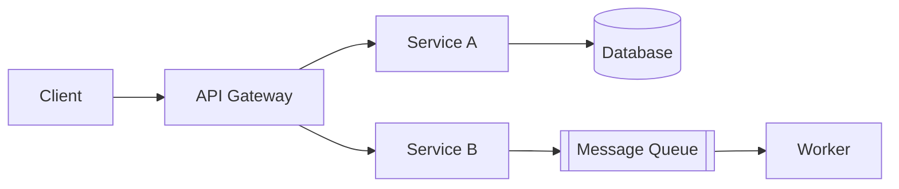
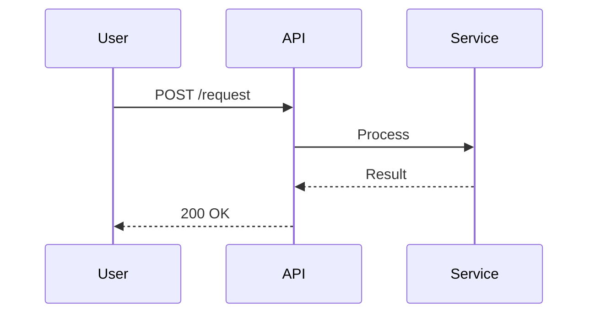
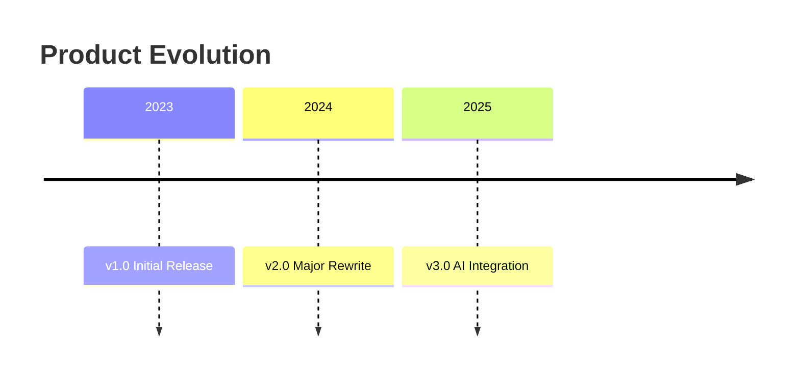
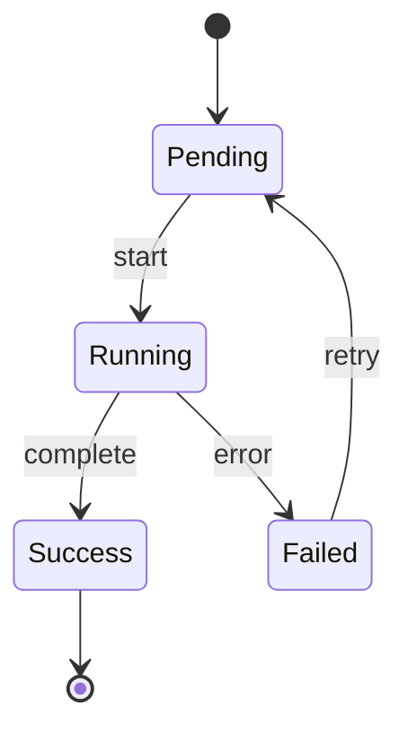
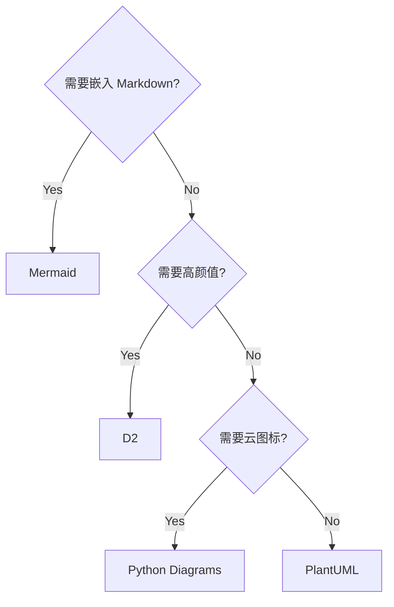
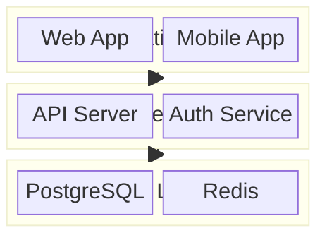
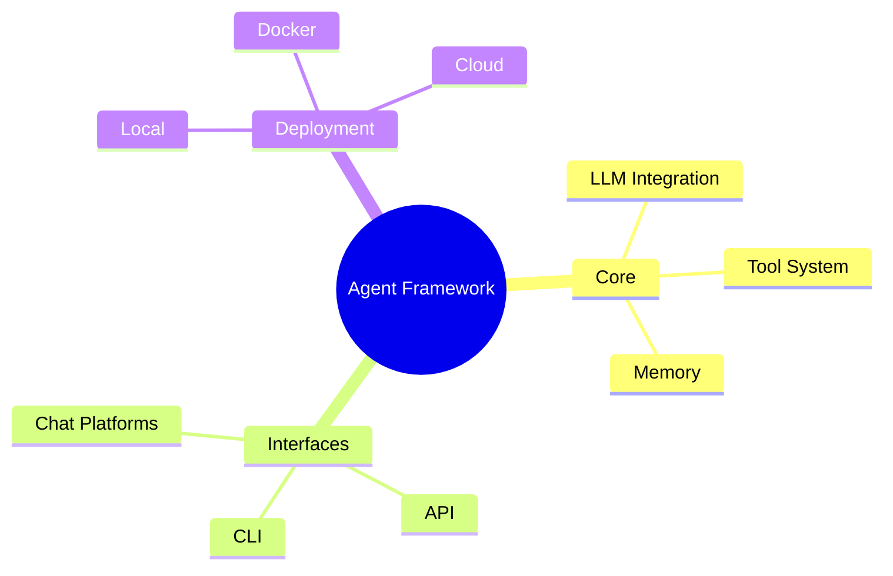

# Mermaid 图表规范

本文档定义 deep-research skill 在报告中使用 Mermaid 图表的规范。

---

## 何时画图

当调研内容涉及以下场景时，**必须**使用 Mermaid 图表：

- **系统架构**：组件之间的层级、依赖、通信关系
- **数据流 / 流程**：请求链路、数据处理 pipeline、工作流步骤
- **时序交互**：多个角色/服务之间的调用顺序
- **状态机**：对象的状态转换逻辑
- **对比决策树**：多方案选型的决策路径
- **时间线演进**：产品/技术的版本演进历程
- **模块/类关系**：代码层面的模块依赖、继承关系

> 不要为画图而画图——简单的列表/表格能说清楚的，不必强行上图。

---

## 图表类型选择

根据内容选择最合适的类型：

| 类型 | Mermaid 语法 | 适用场景 | 示例 |
|------|-------------|---------|------|
| **流程图** | `flowchart LR` / `flowchart TD` | 系统架构、处理流程、决策逻辑 | 微服务架构、CI/CD pipeline |
| **时序图** | `sequenceDiagram` | 多方交互、API 调用链、协议握手 | OAuth 流程、RPC 调用链 |
| **类图** | `classDiagram` | 模块关系、接口定义、继承体系 | SDK 类结构、插件系统 |
| **状态图** | `stateDiagram-v2` | 状态机、生命周期、任务状态流转 | 订单状态机、Agent 执行状态 |
| **时间线** | `timeline` | 版本演进、技术发展史、里程碑 | 产品 release history |
| **脑图** | `mindmap` | 概念分类、知识体系、功能总览 | 框架功能概览 |
| **块图** | `block-beta` | 分层架构、堆栈图 | 技术栈、存储分层 |
| **架构图** | `architecture-beta` | 带图标的分层架构（Mermaid v11+） | 云服务架构 |

---

## 语法规范

### 1. 代码块格式

使用标准 fenced code block：

````markdown

````

### 2. 图表标题

每个 Mermaid 代码块**上方**必须加一行 Markdown 文字说明，如：

```markdown
**图 1：系统整体架构**


```

### 3. 节点标签

使用简短的中/英文（匹配报告语言），避免过长标签：

- ✅ `A[API Gateway]`
- ❌ `A[The API Gateway Service That Handles All Incoming Requests]`

### 4. 连线标签

标注协议、数据格式或关系类型：

```
A -->|REST/JSON| B
A -->|gRPC| C
A -.->|async| D
```

### 5. 逻辑分组

使用 `subgraph` 对相关组件分组：



### 6. 图表规模控制

单图不超过 **15-20 个节点**。复杂系统拆分为多张图：

- 图 1：高层架构总览（L1/L2）
- 图 2：核心模块详细交互（L3）
- 图 3：数据流 pipeline

---

## 质量要求

- **可渲染**：图表必须是合法的 Mermaid 语法，能被 [mermaid.live](https://mermaid.live) 正确渲染
- **特殊字符处理**：节点标签中包含 `()` `{}` `[]` `"` 等特殊字符时，用引号包裹整个标签：`A["Node (v2)"]`
- **避免语法陷阱**：
  - 节点 ID 不要用 `end`、`subgraph` 等 Mermaid 保留字
  - 注意 `---` 和 `-->` 的区别
  - `flowchart` 优于 `graph`（前者支持更多特性）
- **一图一主题**：每张图聚焦一个抽象层级或一个视角，不混杂

---

## 常用模式速查

### 微服务架构



### 时序交互



### 版本时间线



### 状态流转



### 决策树



### 分层架构



### 脑图（功能总览）



---

## 跨平台兼容性

Mermaid 原生渲染支持有限。写图表时无需关心兼容性问题——**deep-research skill 会在报告生成后自动用 `mmdc` 渲染图片版本**。

### 支持 Mermaid 原生渲染的平台

- GitHub, GitLab, Notion, Obsidian, VS Code (需插件)
- 这些平台可直接使用 `report.md`（含 Mermaid 源码）

### 不支持 Mermaid 的平台（需要图片版本）

- 微信公众号、知乎、小红书、飞书、语雀
- Medium、Confluence (无插件时)、Bitbucket
- 邮件客户端、PDF 导出
- 这些平台应使用 `report-rendered.md`（Mermaid 已转为 SVG 图片）

### 渲染工具

```bash
# 自动渲染（skill 流程中自动执行，输出 PNG 格式，白色背景）
npx -y -p @mermaid-js/mermaid-cli mmdc -i report.md -o report-rendered.md -e png -t default -b white

# 手动重新渲染（修改报告后）
npx -y -p @mermaid-js/mermaid-cli mmdc -i report.md -o report-rendered.md -e png -t default -b white
```

> **为什么用 PNG 而非 SVG？** 知乎、小红书等平台不支持 SVG 图片格式，PNG 是所有平台的最大公约数。`-b white` 避免透明底色在深色模式下不可读。
